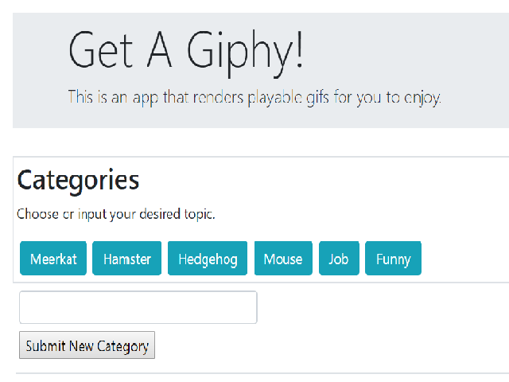

# GIPHY-API

## Project Purpose 
This is an app that renders playable gifs for the user to enjoy.

## Demo
<br> <--Update after putting in portfolio
[Click here to start](https://mkd454.github.io/GIPHY-API/)

## Getting Started 
````
git clone git@github.com:mkd454/GIPHY-API.git
open index.html in your preferred browser
````

## Instructions

* When the user clicks on a button, the page will render 10 static, non-animated gif images from the GIPHY API and place them on the page.

* When the user clicks one of the still GIPHY images, the gif will animate. If the user clicks the gif again, it stops playing.

* Under every gif, it will display its rating (PG, G, so on).
   * This data is provided by the GIPHY API.

* Users are allowed to add onto the buttons using the form to input what gis they want to search

## Built With
- HTML & CSS
- Javascript
- [Bootstrap](https://getbootstrap.com/)
- [jQuery](https://jquery.com/download/)

## Where users can get help with this project
If you need assistance, please reach out to this email with your questions and concerns: <dangmaryk@gmail.com>.

## Who maintains and contributes to this project 
Mary Dang  
Github Repository link: <https://github.com/mkd454/GIPHY-API>  
Github page link: <https://mkd454.github.io/GIPHY-API/>  
Bootstrap Portfolio link: <https://mkd454.github.io/Bootstrap-Portfolio/>

## Acknowledgments

* Thanks to The Coding Boot Camp at UT Austin

## Future Development
- [ ] Make it mobile responsive.

- [ ] Allow users to request additional gifs to be added to the page.
   * Each request should ADD 10 gifs to the page, NOT overwrite the existing gifs.

- [ ] List additional metadata (title, tags, etc) for each gif in a clean and readable format.

- [ ] Include a 1-click download button for each gif, this should work across device types.

- [ ] Integrate this search with additional APIs such as OMDB, or Bands in Town. Be creative and build something you are proud to showcase in your portfolio

- [ ] Allow users to add their favorite gifs to a `favorites` section.
   * This should persist even when they select or add a new topic.
   * If you are looking for a major challenge, look into making this section persist even when the page is reloaded(via localStorage or cookies).

- - -